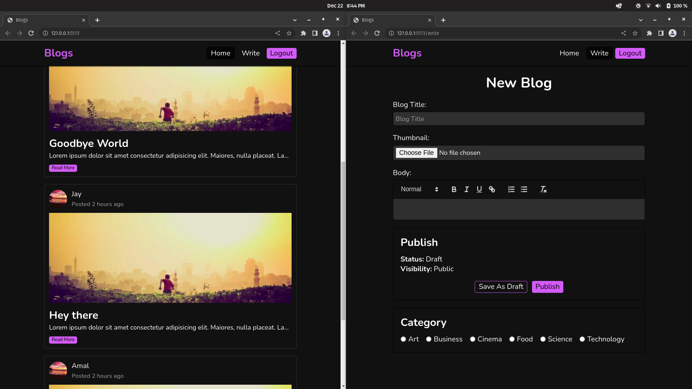

# Writer's Avenue

Writer's Avenue is an open-source blog publishing website with its frontend written in React & Sass, Node.js (Express) for backend and MariaDB for database.



As of now, the following things are implemented:

- user can register/login with their email or Google account (OAuth 2.0)
- if a user doesn't upload an avatar while registering, a default avatar will be set
- users can create, read, update & delete posts
- view profile of other users 👀
- users can post comments on posts
- can save drafts instead of directly publishing the posts
- user can edit a published post & save those changes as a draft on the server without affecting the published post 😌

## How to run this project locally

Note: these steps are tested on Linux (Pop OS) with Node v16.16.0 & MariaDB server v10.6.11.

1. make sure Node, NPM, Yarn & MariaDB are installed.
2. there are 3 dotenvs:

   - _/dummy.env_
   - _server/dummy.env_
   - _/client/dummy.env_.

   read them, populate them with proper values & rename those files from _dummy.env_ to just _.env_.

3. install dependencies by executing `yarn` in project's root directory & also in client & server directores.
4. execute this in project's root directory:
   ```
   yarn setup
   ```
5. execute this in server directory:
   ```
   yarn dev
   ```
6. execute this in client directory:
   ```
   yarn dev
   ```
7. play around with this project & say good things to reward me with some dopamine 😌
