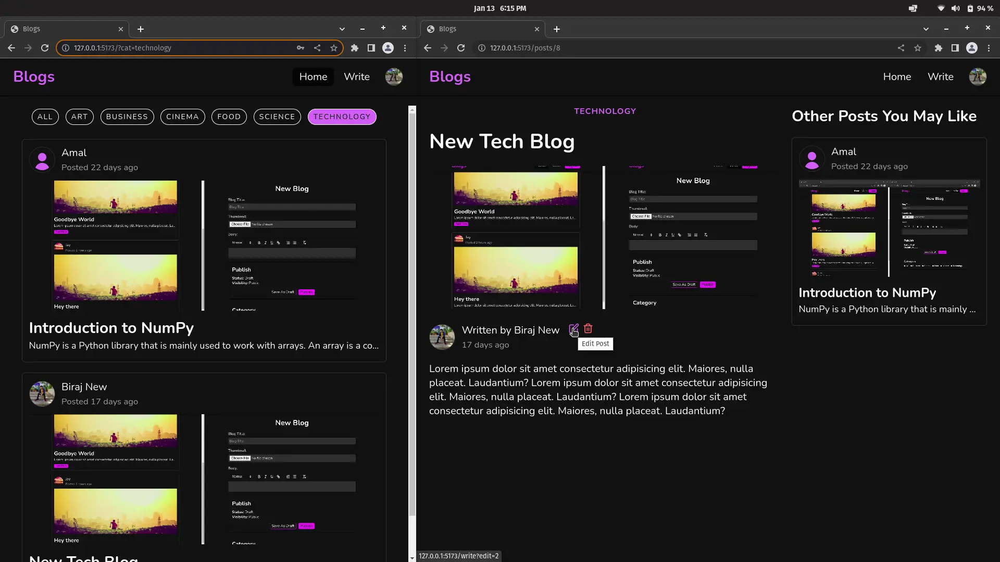

# React Blogs
A blog website with frontend written in React & Sass, Node.js (Express) for backend and MariaDB for database. It uses JWT for authentication - getting the token form local storage & sending it to the server with every request.

