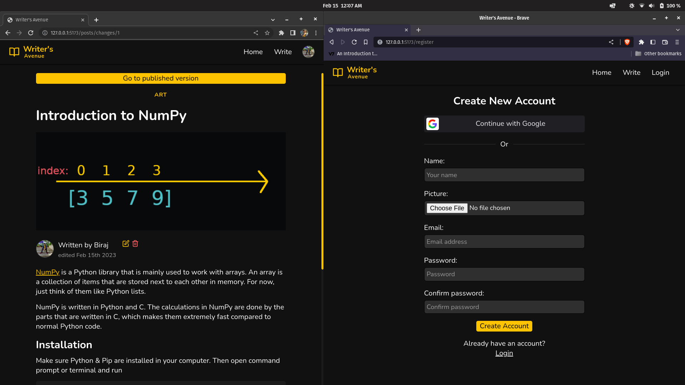

# Writer's Avenue

Writer's Avenue is an open-source blog publishing website with its frontend written in React & Sass, Node.js (Express) for backend and MariaDB for database.



As of now, the following things are implemented:

- user can register/login with their email or Google account (OAuth 2.0)
- if a user doesn't upload an avatar while registering, a default avatar will be set
- users can create, read, update & delete posts
- view profile of other users 👀
- users can post comments on posts
- can save drafts instead of directly publishing the posts\
- user can edit a published post & save those changes as a draft on the server without affecting the published post 😌

## How to run this project locally

Note: these steps are tested on Linux (Pop OS) with Node v16.16.0 & MariaDB server v10.6.11.

1. clone this repo (duh 🤡)
2. make sure Node, NPM, Yarn & MariaDB are installed
3. create a **.env** file in project's root directory:
   ```
   DB_HOST=locahost
   DB_USER=<your db username>
   DB_PASSWORD=<your db password>
   ```
4. create another **.env** file in server directory:
   ```
   PORT=<port>
   SERVER_URL=http://localhost:<port>
   DB_HOST=localhost
   DB_USER=<your db username>
   DB_PASSWORD=<your db password>
   DB_NAME=blogs
   JWT_SECRET=<secret or private key for jwt>
   ```
5. install dependencies by executing `yarn` in project's root directory & also in client & server directores.
6. execute this in project's root directory:
   ```
   yarn setup
   ```
7. execute this in server directory:
   ```
   yarn dev
   ```
8. set server's url in **client/src/index.jsx** _(line 9)_
   ```javascript
   axios.defaults.baseURL = "http://localhost:<port>";
   ```
9. execute this in client directory:
   ```
   yarn dev
   ```
10. play around with this project & say good things to reward me with some dopamine 😌
